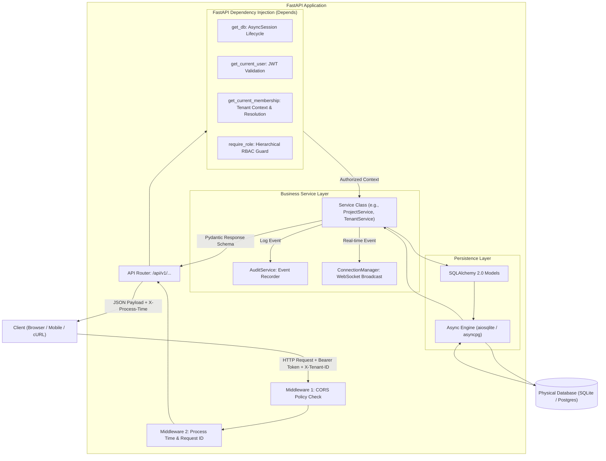
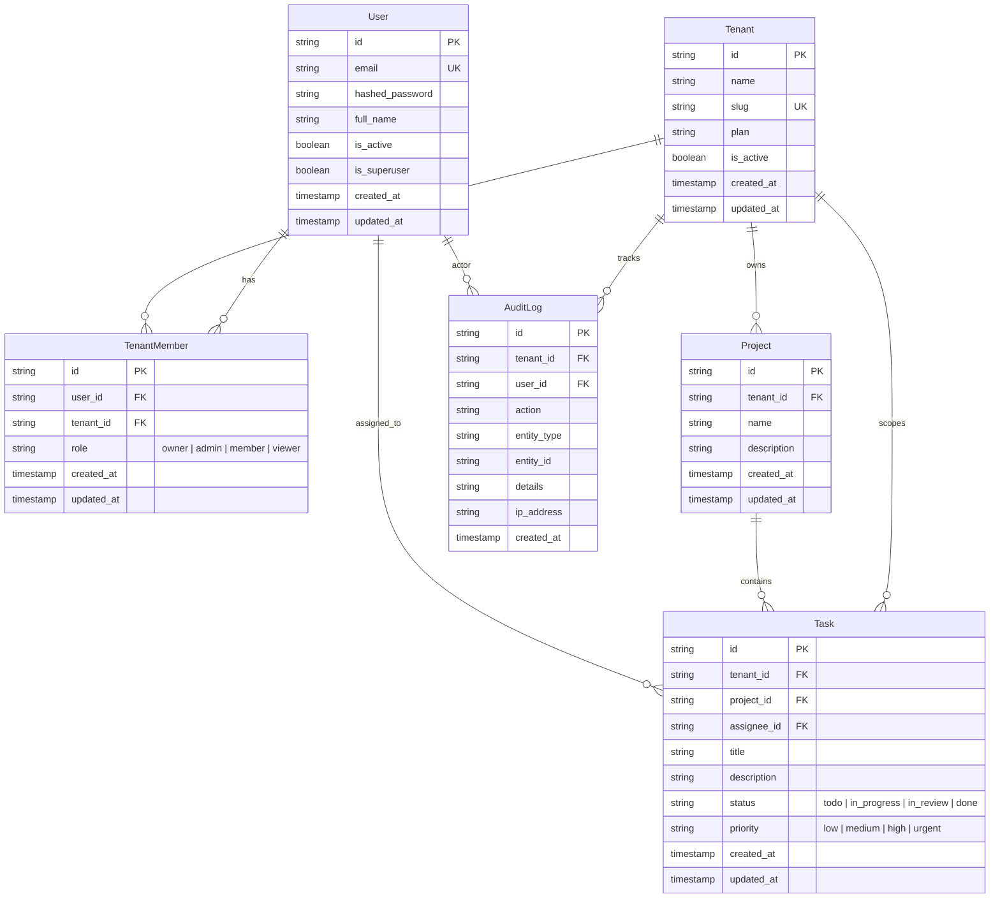
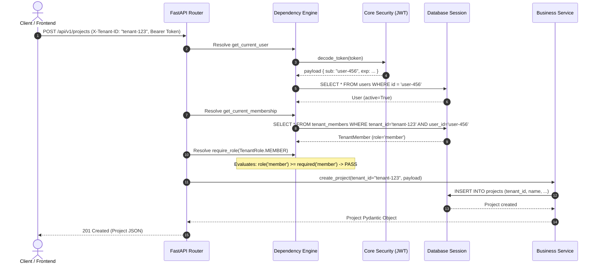
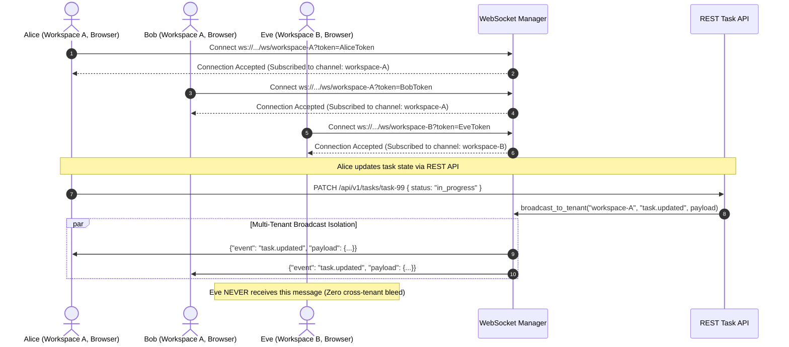

# NovaPulse SaaS: Zero-to-Production FastAPI Master Guide
### Enterprise Multi-Tenant Platform Engineering Reference

---

# TABLE OF CONTENTS
1. [Section 1: Business Requirements Document (BRD)](#section-1-business-requirements-document-brd)
2. [Section 2: Technical Specifications Document (TSD)](#section-2-technical-specifications-document-tsd)
3. [Section 3: System Design & Architecture Diagrams](#section-3-system-design--architecture-diagrams)
4. [Section 4: Comprehensive File Tree & Component Map](#section-4-comprehensive-file-tree--component-map)
5. [Section 5: Module-by-Module Deep Dive](#section-5-module-by-module-deep-dive)
6. [Section 6: Micro-to-Macro Build Guide (Zero to Hero A-Z)](#section-6-micro-to-macro-build-guide-zero-to-hero-a-z)
7. [Section 7: Verification, Testing & Deployment](#section-7-verification-testing--deployment)

---

# SECTION 1: BUSINESS REQUIREMENTS DOCUMENT (BRD)

## 1.1 Executive Summary
Modern B2B Software-as-a-Service (SaaS) products require multi-tenant architectures where multiple organizations (tenants) share underlying compute and storage infrastructure while maintaining total data privacy, granular access delegation, auditability, and real-time collaboration.

**NovaPulse** is designed to provide an enterprise-ready foundation for a collaborative Project & Task Management SaaS. It solves the critical operational challenges of user management, multi-tenancy boundaries, role-based security, live events, and regulatory auditing.

## 1.2 Target Personas
1. **Tenant Owner**: The business owner or executive who creates the corporate workspace, manages subscription tiers, invites administrators, and holds ultimate governance over the organization's data.
2. **Tenant Administrator**: Team leaders who manage day-to-day operations, invite/remove contributors, create projects, and review audit logs.
3. **Tenant Member (Engineer/Contributor)**: Core team members who create, update, and transition tasks, comment on items, and receive real-time notifications.
4. **Tenant Viewer (Stakeholder/Auditor)**: Read-only stakeholders who require visibility into project statuses without permission to mutate data.
5. **System Superuser**: Platform operator responsible for server health, global maintenance, and system-level diagnostics.

## 1.3 Business & Functional Requirements

| Req ID | Domain | Requirement Statement | Business Justification |
| :--- | :--- | :--- | :--- |
| **BR-01** | **Identity** | Users must register with email and secure password, instantly receiving their default personal workspace. | Minimizes onboarding friction and enables immediate value delivery. |
| **BR-02** | **Multi-Tenancy** | Users must be able to belong to multiple workspaces (e.g., Personal, Consulting Client A, Startup B) with distinct roles in each. | Reflects modern business reality where consultants and cross-team members operate across organizations. |
| **BR-03** | **Data Isolation** | No user or query shall ever leak data across workspace boundaries. Accessing resources outside authorized workspaces must return strict `403 Forbidden` or `404 Not Found`. | Legal compliance (GDPR, SOC2, HIPAA) and brand security. |
| **BR-04** | **RBAC Hierarchy** | Operations must be gated by a 4-tier Role-Based Access Control matrix: `VIEWER` < `MEMBER` < `ADMIN` < `OWNER`. | Minimizes human error and prevents unauthorized deletion or privilege escalation. |
| **BR-05** | **Live Collaboration** | Task creation, status updates, and deletions must push instantaneous updates to all users currently viewing the active workspace. | Eliminates stale data, prevents double work, and creates a responsive user experience. |
| **BR-06** | **Audit Trail** | Every mutating workspace action (creation, member invite, role change, project creation) must record an immutable audit log. | Essential for enterprise security reviews, post-mortem analysis, and regulatory compliance. |

## 1.4 Non-Functional Requirements (NFRs)
- **Security**: Passwords hashed using memory-hard Argon2id (resistant to GPU/ASIC brute-force attacks). Stateless JWT authentication with short-lived access tokens (30 mins) and long-lived refresh tokens (7 days).
- **Latency & Performance**: P99 read latency < 25ms under standard loads. Fully asynchronous non-blocking I/O across database access and network sockets.
- **Traceability**: Every request must carry a unique `X-Request-ID` and report execution duration in `X-Process-Time`.
- **Database Portability**: Clean abstraction using SQLAlchemy 2.0 Async, supporting SQLite in local development and zero-code transition to PostgreSQL in production.

---

# SECTION 2: TECHNICAL SPECIFICATIONS DOCUMENT (TSD)

## 2.1 Technology Stack & Version Matrix

| Technology | Version | Purpose in NovaPulse | Selection Rationale |
| :--- | :--- | :--- | :--- |
| **Python** | 3.11+ | Runtime environment | Native async performance gains, improved exception groups, and strict type hinting. |
| **FastAPI** | 0.110+ | ASGI Web Framework | High performance, automatic OpenAPI 3.0 generation, and powerful dependency injection. |
| **Uvicorn** | 0.29+ | ASGI Production Server | Standard lightning-fast ASGI implementation with uvloop and watchfiles integration. |
| **SQLAlchemy** | 2.0+ | Database ORM & Core | Async-first declarative syntax with strict typed `Mapped[]` columns. |
| **Pydantic** | 2.6+ | Validation & Serialization | Rust-powered `pydantic-core`, up to 20x faster serialization than v1. |
| **Pydantic Settings** | 2.2+ | Configuration Management | Strict typed environment variables with auto `.env` parsing and caching. |
| **Alembic** | 1.13+ | Database Migrations | Version-controlled schema migrations with async dialect support. |
| **Argon2-cffi** | 23.1+ | Password Hashing | Winner of the Password Hashing Competition (PHC); superior to bcrypt against GPU attacks. |
| **PyJWT** | 2.8+ | Token Encoding & Validation | Industry-standard RFC 7519 JSON Web Token implementation. |
| **Pytest + HTTPX** | Latest | Asynchronous Testing Suite | In-process ASGI transport testing without requiring open TCP network ports. |

## 2.2 Database Schema & Data Dictionary

```sql
-- Conceptual DDL representation of NovaPulse Tables

CREATE TABLE users (
    id VARCHAR(36) PRIMARY KEY, -- UUIDv4 string
    email VARCHAR(255) UNIQUE NOT NULL,
    hashed_password VARCHAR(255) NOT NULL,
    full_name VARCHAR(150) NOT NULL,
    is_active BOOLEAN NOT NULL DEFAULT TRUE,
    is_superuser BOOLEAN NOT NULL DEFAULT FALSE,
    created_at TIMESTAMP WITH TIME ZONE NOT NULL,
    updated_at TIMESTAMP WITH TIME ZONE NOT NULL
);

CREATE TABLE tenants (
    id VARCHAR(36) PRIMARY KEY,
    name VARCHAR(100) NOT NULL,
    slug VARCHAR(100) UNIQUE NOT NULL,
    plan VARCHAR(50) NOT NULL DEFAULT 'free',
    is_active BOOLEAN NOT NULL DEFAULT TRUE,
    created_at TIMESTAMP WITH TIME ZONE NOT NULL,
    updated_at TIMESTAMP WITH TIME ZONE NOT NULL
);

CREATE TABLE tenant_members (
    id VARCHAR(36) PRIMARY KEY,
    user_id VARCHAR(36) NOT NULL REFERENCES users(id) ON DELETE CASCADE,
    tenant_id VARCHAR(36) NOT NULL REFERENCES tenants(id) ON DELETE CASCADE,
    role VARCHAR(20) NOT NULL DEFAULT 'member', -- 'owner', 'admin', 'member', 'viewer'
    created_at TIMESTAMP WITH TIME ZONE NOT NULL,
    updated_at TIMESTAMP WITH TIME ZONE NOT NULL,
    CONSTRAINT uq_user_tenant_membership UNIQUE (user_id, tenant_id)
);

CREATE TABLE projects (
    id VARCHAR(36) PRIMARY KEY,
    tenant_id VARCHAR(36) NOT NULL REFERENCES tenants(id) ON DELETE CASCADE,
    name VARCHAR(150) NOT NULL,
    description TEXT,
    created_at TIMESTAMP WITH TIME ZONE NOT NULL,
    updated_at TIMESTAMP WITH TIME ZONE NOT NULL
);

CREATE TABLE tasks (
    id VARCHAR(36) PRIMARY KEY,
    tenant_id VARCHAR(36) NOT NULL REFERENCES tenants(id) ON DELETE CASCADE,
    project_id VARCHAR(36) NOT NULL REFERENCES projects(id) ON DELETE CASCADE,
    assignee_id VARCHAR(36) REFERENCES users(id) ON DELETE SET NULL,
    title VARCHAR(200) NOT NULL,
    description TEXT,
    status VARCHAR(20) NOT NULL DEFAULT 'todo', -- 'todo', 'in_progress', 'in_review', 'done'
    priority VARCHAR(20) NOT NULL DEFAULT 'medium', -- 'low', 'medium', 'high', 'urgent'
    created_at TIMESTAMP WITH TIME ZONE NOT NULL,
    updated_at TIMESTAMP WITH TIME ZONE NOT NULL
);

CREATE TABLE audit_logs (
    id VARCHAR(36) PRIMARY KEY,
    tenant_id VARCHAR(36) NOT NULL REFERENCES tenants(id) ON DELETE CASCADE,
    user_id VARCHAR(36) REFERENCES users(id) ON DELETE SET NULL,
    action VARCHAR(100) NOT NULL, -- e.g., 'task.created', 'member.added'
    entity_type VARCHAR(50) NOT NULL,
    entity_id VARCHAR(36),
    details TEXT,
    ip_address VARCHAR(45),
    created_at TIMESTAMP WITH TIME ZONE NOT NULL,
    updated_at TIMESTAMP WITH TIME ZONE NOT NULL
);
```

## 2.3 Role-Based Access Control (RBAC) Matrix

| Endpoint / Operation | Minimum Role Required | Behavior on Violation |
| :--- | :--- | :--- |
| `GET /api/v1/workspaces` | Authenticated User | Returns only workspaces where user has membership. |
| `POST /api/v1/workspaces` | Authenticated User | Creates workspace; assigns user as `OWNER`. |
| `GET /api/v1/workspaces/{id}` | `VIEWER` | Returns workspace details and member roster. |
| `POST /api/v1/workspaces/{id}/members` | `ADMIN` | Adds or updates member role. Cannot grant higher than caller's role. |
| `DELETE /api/v1/workspaces/{id}/members/{u_id}` | `ADMIN` | Removes member. Cannot delete the only remaining `OWNER`. |
| `GET /api/v1/projects` | `VIEWER` | Lists all projects within tenant. |
| `POST /api/v1/projects` | `MEMBER` | Creates project in tenant. |
| `PATCH /api/v1/projects/{id}` | `ADMIN` | Updates project metadata. |
| `DELETE /api/v1/projects/{id}` | `ADMIN` | Deletes project and cascades delete to all child tasks. |
| `GET /api/v1/tasks` | `VIEWER` | Lists and filters tasks in tenant. |
| `POST /api/v1/tasks` | `MEMBER` | Creates task and broadcasts real-time WS notification. |
| `PATCH /api/v1/tasks/{id}` | `MEMBER` | Updates task status/priority and broadcasts WS update. |
| `DELETE /api/v1/tasks/{id}` | `ADMIN` | Removes task and broadcasts WS deletion event. |
| `GET /api/v1/audit-logs` | `ADMIN` | Retrieves paginated historical audit trail for workspace. |

---

# SECTION 3: SYSTEM DESIGN & ARCHITECTURE DIAGRAMS

## 3.1 Clean Architecture Flow (Request-Response Lifecycle)



## 3.2 Entity Relationship Diagram (ERD)



## 3.3 Multi-Tenant Authentication & RBAC Verification Sequence



## 3.4 Real-Time WebSocket Multi-Tenant Distribution



---

# SECTION 4: COMPREHENSIVE FILE TREE & COMPONENT MAP

```
c:\Coding\fastAPI\
│
├── .env                              # Active environment configuration (git-ignored)
├── .env.example                      # Template for production environment variables
├── .gitignore                        # Git exclusion rules (venv, db, caches, keys)
├── alembic.ini                       # Alembic CLI runtime configuration
├── pytest.ini                        # Pytest-asyncio configuration & warning filters
├── requirements.txt                  # Locked production dependencies
├── README.md                         # Quickstart overview and orientation
├── DOCUMENTATION.md                  # This master reference document
│
├── alembic/                          # Database Migration Environment
│   ├── env.py                        # Dynamic migration runner connecting settings + Base
│   ├── README                        # Alembic documentation
│   ├── script.py.mako                # Template for generating migration scripts
│   └── versions/                     # Revision history directory
│       └── 210230045668_initial_...  # Initial migration (tables, indexes, constraints)
│
├── app/                              # Core Application Package
│   ├── __init__.py                   # Package identifier and version definition
│   ├── main.py                       # App factory, lifespan manager, CORS, middlewares
│   │
│   ├── api/                          # HTTP & WebSocket Presentation Layer
│   │   ├── __init__.py
│   │   ├── deps.py                   # Reusable FastAPI dependency injection providers
│   │   └── v1/                       # API Version 1
│   │       ├── __init__.py
│   │       ├── api_router.py         # Consolidates all sub-routers under /api/v1
│   │       ├── auth.py               # Registration, JSON login, OAuth2 login, refresh, me
│   │       ├── tenants.py            # Workspace CRUD, membership invitations & role changes
│   │       ├── projects.py           # Projects endpoints with tenant isolation
│   │       ├── tasks.py              # Task CRUD with live WebSocket event dispatch
│   │       ├── websockets.py         # Authenticated per-tenant WebSocket connection endpoint
│   │       └── audit_logs.py         # Paginated security and activity audit trail
│   │
│   ├── core/                         # Infrastructure & Low-Level Foundations
│   │   ├── __init__.py
│   │   ├── config.py                 # Pydantic BaseSettings class loading .env with caching
│   │   ├── database.py               # Async SQLAlchemy engine, sessionmaker, and get_db()
│   │   ├── security.py               # Argon2 password hasher and JWT encode/decode logic
│   │   ├── exceptions.py             # Custom domain exceptions and standard JSON handlers
│   │   └── logging.py                # Structured console logging configuration
│   │
│   ├── models/                       # SQLAlchemy 2.0 Declarative ORM Models
│   │   ├── __init__.py               # Exports all models for easy discovery by Alembic
│   │   ├── base.py                   # TimestampedBase with UUID PKs & UTC timestamps
│   │   ├── user.py                   # User model with authentication and superuser flags
│   │   ├── tenant.py                 # Tenant / Workspace model with plan and slug
│   │   ├── membership.py             # TenantMember model with TenantRole enum & hierarchy
│   │   ├── project.py                # Project and Task models with enums
│   │   └── audit_log.py              # AuditLog model for recording tenant events
│   │
│   ├── schemas/                      # Pydantic v2 Request/Response Validation Contracts
│   │   ├── __init__.py
│   │   ├── auth.py                   # Token, LoginRequest, RegisterRequest
│   │   ├── user.py                   # UserBase, UserCreate, UserUpdate, UserResponse
│   │   ├── tenant.py                 # TenantBase, TenantCreate, TenantMember schemas
│   │   ├── project.py                # Project and Task creation/response schemas
│   │   └── audit_log.py              # AuditLogResponse schema
│   │
│   └── services/                     # Pure Business Logic Layer (Framework Decoupled)
│       ├── __init__.py
│       ├── auth_service.py           # User registration, verification, token generation
│       ├── tenant_service.py         # Workspace creation, member roster, role mutation
│       ├── project_service.py        # Project & Task operations scoped to tenant_id
│       ├── audit_service.py          # Asynchronous audit event recorder and query engine
│       └── notification_service.py   # ConnectionManager handling WebSocket tenant rooms
│
├── scripts/                          # Operational & Administrative Utilities
│   └── seed_demo_data.py             # Populates demo accounts, workspaces, and tasks
│
└── tests/                            # Asynchronous Automated Test Suite
    ├── __init__.py
    ├── conftest.py                   # In-memory SQLite engine and AsyncClient fixtures
    ├── test_auth.py                  # Health check, registration, and login assertions
    ├── test_multi_tenancy.py         # Cross-tenant data isolation and RBAC security tests
    └── test_tasks_and_audit.py       # Task lifecycle and audit trail assertions
```

---

# SECTION 5: MODULE-BY-MODULE DEEP DIVE

## Module 1: Configuration Management (`app/core/config.py`)
- **Pattern**: 12-Factor App methodology. All configuration reads from environment variables with fallback defaults.
- **Why Pydantic Settings?**: Unlike `os.getenv()`, Pydantic performs type coercion and runtime validation. If `ACCESS_TOKEN_EXPIRE_MINUTES` is set to `"foo"`, the application fails fast at startup with a clear error rather than crashing mid-request.
- **Optimization**: Wrapped in `@lru_cache` via `get_settings()` so disk I/O occurs once.

## Module 2: Async Database Engine & Session Management (`app/core/database.py`)
- **Engine Creation**: `create_async_engine(settings.DATABASE_URL, future=True)`.
- **Async Session Factory**: `async_sessionmaker(bind=engine, expire_on_commit=False, autoflush=False)`. Setting `expire_on_commit=False` prevents SQLAlchemy from emitting lazy-load SQL statements on model attributes after commit, which would cause `MissingGreenlet` errors in async code.
- **The `get_db` Generator**:
  ```python
  async def get_db() -> AsyncGenerator[AsyncSession, None]:
      async with AsyncSessionLocal() as session:
          try:
              yield session
              await session.commit()
          except Exception:
              await session.rollback()
              raise
          finally:
              await session.close()
  ```
  Every request receives an isolated database transaction. If any unhandled exception occurs in a service or router, the transaction rolls back automatically.

## Module 3: Security, Hashing & JWT (`app/core/security.py`)
- **Argon2id**: Utilizes the modern `argon2-cffi` library. It uses configurable memory and time costs, rendering GPU-based rainbow table and dictionary attacks impractical.
- **Token Dual Strategy**:
  - `access_token`: Short lifespan (30 minutes). Carried in `Authorization: Bearer <token>` header. Contains `sub` (User UUID) and `type: "access"`.
  - `refresh_token`: Long lifespan (7 days). Stored securely by the client to request new access tokens without re-entering credentials.

## Module 4: Multi-Tenant Data Modeling & RBAC (`app/models/`)
- **UUIDv4 Identifiers**: Using integer auto-incrementing IDs (`1`, `2`, `3`) leaks business velocity (competitors can see how many orders you process per day) and invites Insecure Direct Object Reference (IDOR) attacks. NovaPulse enforces 36-character UUIDs across all models.
- **Tenant Role Hierarchy**:
  ```python
  class TenantRole(str, Enum):
      OWNER = "owner"
      ADMIN = "admin"
      MEMBER = "member"
      VIEWER = "viewer"
  ```
  A numeric hierarchy (`VIEWER: 1`, `MEMBER: 2`, `ADMIN: 3`, `OWNER: 4`) allows clean comparison logic: `user_role.has_privilege_of(required_role)`.

## Module 5: Dependency Injection & Security Guards (`app/api/deps.py`)
FastAPI dependencies are evaluated from the outside in:
1. `get_current_user`: Ensures the caller is an active, verified platform user.
2. `get_tenant_id_from_request`: Extracts the workspace ID from the `X-Tenant-ID` header, URL path param (`/workspaces/{tenant_id}`), or query param.
3. `get_current_membership`: Queries `tenant_members` to guarantee the caller actually belongs to the target workspace. If not, raises `403 Forbidden`.
4. `require_role(min_role)`: A higher-order dependency factory that checks if the caller's membership rank satisfies the endpoint's minimum security threshold.

## Module 6: Business Service Layer (`app/services/`)
- **Separation of Concerns**: API route handlers only handle HTTP request parsing, status codes, and response schemas. All business rules (e.g., verifying that a project exists within the same tenant before attaching a task) reside in pure asynchronous service classes.
- **Preventing Cross-Tenant Leaks**: All service queries strictly filter by `tenant_id`. Even if a user crafts a request with `task_id="abc"`, if `tenant_id="xyz"` does not match the database row, `0` rows are returned, triggering a clean `404 Not Found`.

## Module 7: Real-Time WebSockets (`app/services/notification_service.py` & `app/api/v1/websockets.py`)
- **In-Memory Channel Partitioning**: The `ConnectionManager` stores active socket references grouped in a dictionary `dict[tenant_id, set[WebSocket]]`.
- **Authentication**: Validates JWT tokens passed in the WebSocket handshake query string (`?token=...`).
- **Targeted Broadcast**: When a task is created or updated in Workspace A, only sockets subscribed to Workspace A receive the message. Workspace B clients experience zero network overhead and zero data exposure.

---

# SECTION 6: MICRO-TO-MACRO BUILD GUIDE (ZERO TO HERO A-Z)

This section provides the exact chronological recipe to rebuild NovaPulse from scratch on any machine.

### Step 1: Environment & Virtualenv Setup
```powershell
# 1. Create project directory
mkdir fastAPI
cd fastAPI

# 2. Create isolated Python virtual environment
python -m venv .venv

# 3. Activate virtual environment
# On Windows PowerShell:
.venv\Scripts\Activate.ps1
# On Linux/macOS:
# source .venv/bin/activate

# 4. Upgrade base package manager
python -m pip install --upgrade pip
```

### Step 2: Define Dependencies (`requirements.txt`)
Create `requirements.txt` containing the enterprise package set:
```text
fastAPI>=0.110.0
uvicorn[standard]>=0.29.0
pydantic>=2.6.0
email-validator>=2.0.0
pydantic-settings>=2.2.0
sqlalchemy>=2.0.29
greenlet>=3.0.0
aiosqlite>=0.20.0
alembic>=1.13.0
pyjwt[crypto]>=2.8.0
argon2-cffi>=23.1.0
python-multipart>=0.0.9
httpx>=0.27.0
pytest>=8.1.0
pytest-asyncio>=0.23.0
```
Install them:
```powershell
pip install -r requirements.txt
```

### Step 3: Establish Environment Settings (`.env` and `app/core/config.py`)
Create `.env`:
```ini
PROJECT_NAME="NovaPulse SaaS"
ENVIRONMENT="development"
DEBUG=True
API_V1_STR="/api/v1"
DATABASE_URL="sqlite+aiosqlite:///./novapulse.db"
SECRET_KEY="supersecret-production-grade-key-min-32-chars-long"
ALGORITHM="HS256"
ACCESS_TOKEN_EXPIRE_MINUTES=30
REFRESH_TOKEN_EXPIRE_DAYS=7
CORS_ORIGINS="http://localhost:3000,http://localhost:8000"
```
Create `app/core/config.py` using Pydantic Settings to load and validate these variables.

### Step 4: Configure Database Engine & Base Model
1. In `app/core/database.py`, initialize `create_async_engine`, `async_sessionmaker`, and the `get_db` generator.
2. In `app/models/base.py`, define `TimestampedBase` inheriting from SQLAlchemy's `DeclarativeBase` to supply `id` (UUID string), `created_at` (UTC), and `updated_at` (UTC).

### Step 5: Implement Models & Alembic Migrations
1. Implement `User`, `Tenant`, `TenantMember`, `Project`, `Task`, and `AuditLog` in `app/models/`.
2. Initialize Alembic:
   ```powershell
   alembic init -t async alembic
   ```
3. Update `alembic/env.py` to import `Base` from `app.models` and read `settings.DATABASE_URL`.
4. Generate and run the initial migration:
   ```powershell
   alembic revision --autogenerate -m "Initial enterprise schema"
   alembic upgrade head
   ```

### Step 6: Build Security, Token & RBAC Engines
1. In `app/core/security.py`, initialize Argon2 `PasswordHasher` and PyJWT signing helpers.
2. In `app/api/deps.py`, construct the dependency graph (`get_current_user`, `get_current_membership`, `require_role`).

### Step 7: Construct Business Services
Implement `AuthService`, `TenantService`, `ProjectService`, `AuditService`, and `ws_manager` in `app/services/`.

### Step 8: Build API Routers & Assemble Application
1. Implement the API endpoints in `app/api/v1/`.
2. Combine them inside `app/api/v1/api_router.py`.
3. In `app/main.py`:
   - Initialize FastAPI with OpenAPI metadata.
   - Configure the `@asynccontextmanager lifespan` handler to run `init_db()` and setup logging.
   - Add CORS and performance/request-tracing middlewares.
   - Register centralized domain exception handlers.
   - Include `/health` and `/api/v1` routes.

### Step 9: Seed Demo Data
Run the seeding script to create test accounts:
```powershell
python scripts/seed_demo_data.py
```

### Step 10: Run and Verify
Start Uvicorn in development mode:
```powershell
uvicorn app.main:app --reload --port 8000
```
Access the interactive documentation at `http://127.0.0.1:8000/docs`.

---

# SECTION 7: VERIFICATION, TESTING & DEPLOYMENT

## 7.1 Automated Testing Architecture
Testing async FastAPI applications requires testing the full request-response cycle without invoking external network sockets.

NovaPulse uses **`httpx.AsyncClient` with `ASGITransport`** backed by an **in-memory SQLite async engine (`sqlite+aiosqlite:///:memory:`)**.

### Running the Suite:
```powershell
pytest -v
```

### Test Coverage Highlights:
1. **`tests/test_auth.py`**:
   - `test_health_check`: Probes system liveness and DB connectivity.
   - `test_user_registration_and_login`: Validates user creation, auto-workspace generation, JWT issuance, and password verification.
2. **`tests/test_multi_tenancy.py`**:
   - `test_multi_tenant_isolation_and_rbac`: 
     - User Alice creates Acme SaaS and a project.
     - User Bob attempts to access Alice's project using his own credentials and receives `403 Forbidden`.
     - Alice invites Bob as `VIEWER`; Bob can view but cannot create tasks.
     - Alice promotes Bob to `ADMIN`; Bob can now update and delete tasks.
3. **`tests/test_tasks_and_audit.py`**:
   - `test_task_crud_and_audit_logging`: Validates the full task lifecycle and confirms that mutating actions generate immutable audit log records.

## 7.2 Transitioning to Production (PostgreSQL & Docker)

When moving from development SQLite to production PostgreSQL:
1. Update `.env`:
   ```ini
   DATABASE_URL="postgresql+asyncpg://postgres:securepassword@db:5432/novapulse"
   ENVIRONMENT="production"
   DEBUG=False
   ```
2. Install the asyncpg driver:
   ```powershell
   pip install asyncpg
   ```
3. Run Alembic migrations against the PostgreSQL instance:
   ```powershell
   alembic upgrade head
   ```
4. Run Uvicorn behind Gunicorn with multiple Uvicorn workers:
   ```bash
   gunicorn -k uvicorn.workers.UvicornWorker -w 4 -b 0.0.0.0:8000 app.main:app
   ```

---
*End of NovaPulse Master Engineering Reference.*
